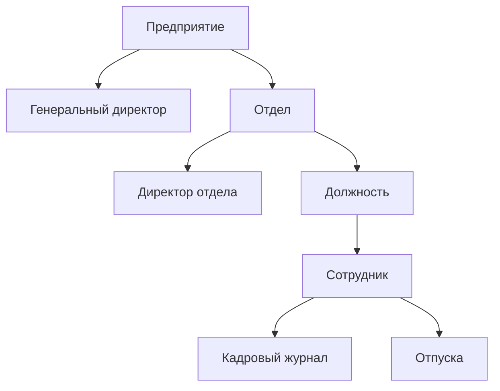
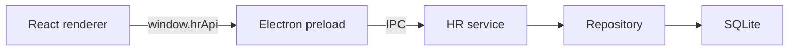

# HR Automation

Локальное desktop-приложение для автоматизации кадрового учёта: организационная структура, сотрудники, назначения, история должностей и зарплаты, образование, опыт работы, отпуска и начисления.

Приложение работает на Electron и хранит данные в локальной SQLite-базе. Критические кадровые правила контролируются не только интерфейсом, но также сервисным слоем, транзакциями, внешними ключами, уникальными индексами и SQLite-триггерами.

## Возможности

- управление предприятиями, отделами и должностями;
- назначение генерального директора предприятия и директора отдела;
- создание и ведение полной карточки сотрудника;
- фильтрация и поиск сотрудников;
- хранение образования и предыдущего опыта работы;
- повышение, понижение и перевод между должностями;
- изменение зарплаты вместе с кадровым назначением или отдельно от него;
- автоматический журнал должностей, отделов и зарплаты;
- расчёт общего стажа и времени на текущей должности;
- оформление оплачиваемых и неоплачиваемых отпусков;
- контроль пересекающихся отпусков и автоматический расчёт дней;
- учёт ежемесячных начислений, надбавок, премий, налогов и удержаний;
- светлая, тёмная и системная темы с выбором акцентного цвета;
- сборка установщиков для Windows, macOS и Linux.

## Организационная модель



Основная иерархия выглядит так:

1. Предприятие является верхним уровнем структуры.
2. Отдел обязательно относится к конкретному предприятию.
3. Должность обязательно относится к конкретному отделу.
4. Сотрудник назначается на одну текущую должность в одном отделе.
5. Изменения назначения и зарплаты фиксируются в кадровом журнале.

## Функциональные модули

### Главная панель

Показывает сводные показатели системы:

- количество сотрудников;
- количество отделов и должностей;
- активные отпуска;
- фонд начислений за текущий месяц;
- последние добавленные сотрудники;
- ближайшие отпуска.

### Предприятия

Раздел организационной структуры построен как последовательная вложенная навигация. Таблица предприятий является первым уровнем: клик по предприятию открывает только его отделы, а клик по отделу — только должности этого отдела. Текущий путь отображается хлебными крошками и сохраняется в URL.

Для предприятия хранятся:

- краткое и юридическое наименование;
- регистрационный номер;
- генеральный директор;
- телефон, email и адрес;
- служебное примечание.

Генеральным директором может быть только активный сотрудник данного предприятия, который не занимает другую руководящую роль.

### Отделы

Отдел содержит:

- предприятие;
- наименование;
- директора отдела;
- контакты и расположение;
- дату создания;
- примечание.

Директором отдела может быть только активный сотрудник этого отдела. Один сотрудник не может руководить несколькими отделами или одновременно быть генеральным директором предприятия.

### Должности

Для должности задаются:

- отдел;
- название;
- базовый оклад;
- надбавка и премия;
- обязанности;
- требования;
- примечание.

При создании сотрудника список должностей фильтруется по выбранному отделу. Базовый оклад выбранной должности подставляется в форму автоматически.

### Сотрудники

Карточка сотрудника включает:

- ФИО, дату рождения и пол;
- телефон и email;
- структурированный адрес;
- предприятие через выбранный отдел;
- отдел, должность и текущую зарплату;
- дату приёма и статус;
- образование;
- предыдущий опыт работы;
- служебные заметки;
- карьеру, стаж и историю назначений;
- отдельные вкладки отпусков и ежемесячных начислений.

Список поддерживает табличный и карточный режимы. Отдельная страница фильтров позволяет искать по ФИО, контактам, отделу, должности, статусу и полу. Выбранные фильтры сохраняются в `localStorage`.

### Образование

Вместо искусственного разделения на школу и университет используется единый уровень образования:

- основное общее;
- среднее общее;
- среднее профессиональное;
- неоконченное высшее;
- бакалавриат;
- специалитет;
- магистратура;
- подготовка кадров высшей квалификации;
- учёная степень.

Дополнительно хранятся учебное заведение, специальность, период обучения, номер документа и примечание.

### Опыт работы

Хранит предыдущие места работы сотрудника:

- компанию;
- должность;
- даты начала и окончания;
- признак текущего места работы;
- обязанности и примечание.

Этот раздел описывает внешний опыт сотрудника. Текущие назначения внутри приложения хранятся отдельно в кадровом журнале.

### Карьера и кадровые изменения

Изменение отдела, должности или зарплаты выполняется только через карточку сотрудника командой `changeEmployment`.

Операция принимает:

- новый отдел;
- новую должность;
- правило изменения зарплаты;
- дату вступления изменения в силу;
- обязательное основание;
- необязательный комментарий.

Доступны три режима зарплаты:

1. сохранить текущую зарплату;
2. установить базовый оклад новой должности;
3. указать новую сумму вручную.

Обновление сотрудника и запись кадрового журнала выполняются в одной SQLite-транзакции. При ошибке операция полностью откатывается.

Прямое изменение `department_id`, `position_id` или `salary` через общий CRUD запрещено. Поэтому кадровый журнал нельзя обойти редактированием обычной формы.

### Кадровый журнал

`employment_history` хранит:

- тип изменения;
- предыдущий и новый отдел;
- предыдущую и новую должность;
- предыдущую и новую зарплату;
- дату вступления в силу;
- основание и комментарий;
- техническую дату создания записи.

При создании сотрудника автоматически появляется запись о приёме. Журнал доступен только для чтения: создавать, изменять или удалять его записи через CRUD нельзя.

Общий стаж рассчитывается от даты приёма, а время на текущей должности — от последней подходящей записи кадрового журнала.

### Отпуска

Отпуска открываются во вкладке конкретного сотрудника. Общей страницы отпусков в основной навигации нет, поэтому создание и редактирование записи всегда происходит в контексте выбранного сотрудника.

Отпуск содержит:

- сотрудника;
- тип отпуска;
- даты начала и окончания;
- количество календарных дней;
- признак оплаты;
- сумму отпускных;
- основание;
- статус и дату согласования;
- примечание.

Количество дней рассчитывает backend включительно по обеим датам. Для неоплачиваемого отпуска сумма отпускных принудительно становится равной нулю.

Плановые и одобренные отпуска одного сотрудника не могут пересекаться. Завершённые или отклонённые записи не блокируют создание нового периода.

### Заработная плата

Ежемесячные начисления открываются в отдельной вкладке карточки сотрудника и используют тот же табличный шаблон, что и отпуска: поиск, сортировку, пагинацию, создание, редактирование и удаление.

Модуль начислений хранит данные по сотруднику и месяцу:

- базовый оклад;
- премию и надбавку;
- удержания и налоги;
- итоговую сумму;
- дату выплаты;
- примечание.

Итог рассчитывается сервисом:

```text
net_amount = base_salary + bonus + allowance - deductions - taxes
```

Для одного сотрудника допускается только одно начисление за конкретный месяц.

## Ключевые бизнес-правила

Правила ниже обеспечиваются backend-слоем и SQLite, а не только состоянием форм.

### Сотрудники и должности

- у сотрудника только одна текущая должность;
- должность обязана принадлежать отделу сотрудника;
- новую должность можно назначить только через кадровое изменение в карточке;
- кадровые изменения доступны только активным сотрудникам;
- дата изменения не может быть раньше даты приёма;
- дата изменения не может быть раньше последней записи журнала;
- нельзя сохранить назначение, которое не отличается от текущего;
- зарплата не может быть отрицательной.

### Руководители

- один сотрудник не может быть генеральным директором нескольких предприятий;
- один сотрудник не может быть директором нескольких отделов;
- нельзя одновременно быть генеральным директором и директором отдела;
- генеральный директор должен работать в отделе выбранного предприятия;
- директор отдела должен работать в руководимом отделе;
- руководителем может быть только активный сотрудник;
- руководителя нельзя деактивировать или перевести, пока он не снят с руководящей роли.

### Удаление и перемещение структуры

- нельзя удалить должность, на которую назначен сотрудник;
- занятую должность нельзя перенести в другой отдел;
- нельзя удалить отдел с сотрудниками или должностями;
- непустой отдел нельзя перенести в другое предприятие;
- нельзя удалить предприятие, пока в нём существуют отделы.

### Отпуска

- окончание не может быть раньше начала;
- количество дней пересчитывается backend-сервисом;
- плановые и одобренные отпуска не пересекаются;
- неоплачиваемый отпуск не может содержать отпускные.

### Старые конфликтующие данные

Миграция `006_enforce_hr_business_rules.sql` нормализует старые повторные назначения руководителей. Конфликтующие связи снимаются, но не теряются: сведения записываются в таблицу `organization_assignment_conflicts` с причиной конфликта.

## Архитектура

Приложение разделено на три слоя:



### Renderer

React-интерфейс не имеет прямого доступа к Node.js или SQLite. Он вызывает типизированный клиент `hrApiClient`.

Основные каталоги:

```text
src/
├── app/                    # layout, навигация, тема и бренд
├── features/
│   ├── employees/          # формы, карточки, карьера и связанные записи
│   ├── filters/            # фильтрация сотрудников
│   ├── hr-entities/        # универсальные CRUD-формы и схемы
│   └── hr-table/           # таблицы и конфигурации колонок
├── pages/                  # страницы приложения
└── shared/                 # UI, типы, i18n, форматирование и API-клиент
```

### Preload и IPC

`electron/preload.ts` публикует ограниченный API через `contextBridge`. IPC-обработчики находятся в `electron/ipc/hrCrudIpc.ts`.

Основные команды:

| Команда               | Назначение                                        |
| --------------------- | ------------------------------------------------- |
| `hr:list`             | Список, поиск, фильтрация, сортировка и пагинация |
| `hr:getById`          | Получение одной записи                            |
| `hr:create`           | Создание разрешённой записи                       |
| `hr:update`           | Обычное обновление записи                         |
| `hr:delete`           | Удаление с проверкой ограничений                  |
| `hr:changeEmployment` | Транзакционное кадровое изменение                 |
| `hr:dashboard`        | Агрегированные показатели главной страницы        |

Окно Electron использует `contextIsolation: true` и `nodeIntegration: false`.

### Service

`HrCrudService` отвечает за бизнес-логику:

- подготовку и нормализацию данных;
- запрет ручного изменения кадрового журнала;
- запрет прямого изменения назначения сотрудника;
- расчёт отпусков;
- расчёт итогового начисления;
- валидацию кадровой команды.

### Repository

`HrCrudRepository` отвечает за SQL-запросы:

- общий CRUD;
- безопасный выбор разрешённых колонок;
- поиск, фильтры, сортировку и пагинацию;
- агрегаты dashboard;
- транзакционное кадровое изменение.

Разрешённые таблицы и редактируемые колонки перечислены в `electron/admin/hrCrudEntities.ts`. Клиент не передаёт произвольные названия таблиц в SQL.

## База данных

SQLite-файл создаётся по пути:

```text
<Electron userData>/database/hr-automation.sqlite
```

Соединение использует:

- `journal_mode = WAL`;
- `foreign_keys = ON`.

Основные таблицы:

| Таблица                             | Назначение                              |
| ----------------------------------- | --------------------------------------- |
| `enterprises`                       | Предприятия и генеральные директора     |
| `departments`                       | Отделы предприятия и их директора       |
| `positions`                         | Должности, оклады и требования          |
| `employees`                         | Текущая карточка сотрудника             |
| `employee_education`                | Образование сотрудника                  |
| `employee_experience`               | Опыт до текущего работодателя           |
| `employment_history`                | Неизменяемый кадровый журнал            |
| `vacations`                         | Отпуска и их согласование               |
| `payroll`                           | Ежемесячные начисления                  |
| `organization_assignment_conflicts` | Конфликты старых руководящих назначений |
| `schema_migrations`                 | Применённые миграции                    |

## Миграции

SQL-миграции находятся в `electron/migrations` и выполняются по имени файла при запуске приложения.

```text
001_initial_hr_schema.sql
002_add_employee_profile_fields.sql
003_drop_employee_code.sql
004_add_employee_education_experience.sql
005_add_organization_and_employee_lifecycle.sql
006_enforce_hr_business_rules.sql
```

Каждая миграция выполняется транзакционно и после успеха регистрируется в `schema_migrations`. Уже применённые файлы повторно не запускаются.

При создании production-сборки каталог миграций копируется в ресурсы приложения через `extraResources`.

## Демонстрационные данные

После миграций приложение проверяет, пуста ли база. Только если во всех основных бизнес-таблицах нет данных, seed создаёт демонстрационное предприятие, связанные с ним отделы и должности, сотрудников, отпуска и начисления.

Для существующей базы seed полностью пропускается: пользовательские данные не дополняются и не перезаписываются демонстрационными записями. Это также делает повторный запуск безопасным после добавления новых ограничений целостности. Seed предназначен для разработки и первичного знакомства с системой.

## Технологии

| Область     | Технологии                            |
| ----------- | ------------------------------------- |
| Desktop     | Electron 43, electron-builder         |
| Frontend    | React 18, TypeScript, Vite 7          |
| UI          | Tailwind CSS 4, Radix UI, React Icons |
| Формы       | React Hook Form, Zod                  |
| Анимации    | Framer Motion                         |
| Локализация | i18next, react-i18next                |
| База данных | SQLite, better-sqlite3                |
| Таблицы     | TanStack Table                        |
| Уведомления | React Toastify                        |

## Требования для разработки

- Node.js 20 или новее;
- npm;
- инструменты сборки нативных Node-модулей для вашей ОС;
- Git.

`better-sqlite3` является нативной зависимостью. Команда `postinstall` вызывает `electron-builder install-app-deps`, чтобы подготовить модуль под используемую версию Electron.

## Установка и запуск

```bash
git clone https://github.com/ramzansharifov/hr-automation.git
cd hr-automation
npm install
npm run dev
```

Работать с HR-функциями следует в открывшемся Electron-окне. Обычный браузер не имеет доступа к preload API и локальной SQLite-базе.

## Команды

| Команда               | Назначение                                              |
| --------------------- | ------------------------------------------------------- |
| `npm run dev`         | Vite dev-сервер и Electron в режиме разработки          |
| `npm run lint`        | ESLint с запретом предупреждений                        |
| `npm run build:check` | TypeScript и production-сборка без упаковки установщика |
| `npm run build`       | Полная сборка и упаковка приложения                     |
| `npm run preview`     | Предпросмотр renderer-сборки в браузере без HR API      |

## Production-сборка

```bash
npm run build
```

Результаты сохраняются в:

```text
release/<version>/
```

Настроенные форматы:

- Windows x64 — NSIS installer;
- macOS — DMG;
- Linux — AppImage.

При удалении Windows-версии база данных пользователя сохраняется, поскольку `deleteAppDataOnUninstall` отключён.

## Проверка изменений

Перед созданием pull request рекомендуется выполнить:

```bash
npm run lint
npm run build:check
git diff --check
```

При изменении схемы данных дополнительно нужно проверить:

1. применение всех миграций на чистой базе;
2. обновление существующей базы;
3. работу seed после новых ограничений;
4. внешние ключи через `PRAGMA foreign_key_check`;
5. положительные и отрицательные бизнес-сценарии.

## Резервное копирование

Приложение является local-first: кадровые данные не отправляются на внешний сервер. Для резервного копирования нужно сохранить каталог:

```text
<Electron userData>/database/
```

Копирование лучше выполнять после полного закрытия приложения, чтобы вместе с основным файлом не оставались несинхронизированные WAL-файлы.

## Ограничения текущей версии

- нет серверной синхронизации между компьютерами;
- нет пользователей, ролей и разграничения доступа;
- нет шифрования SQLite-файла;
- нет вложений и хранения сканов документов;
- нет экспорта отчётов в Excel/PDF;
- расчёт отпусков использует календарные, а не рабочие дни;
- payroll хранит начисления, но не является полноценной бухгалтерской системой.

Перед использованием для реальных персональных данных следует добавить авторизацию, роли, журнал входов, резервное копирование и защиту локальной базы.

## Направления развития

- роли администратора, кадровика, руководителя и наблюдателя;
- отдельный аудит всех CRUD-операций;
- архивирование и увольнение сотрудников отдельной транзакционной командой;
- документы, приказы и вложения;
- рабочий календарь и остатки дней отпуска;
- отчёты и экспорт;
- шифрование базы;
- автоматические резервные копии;
- синхронизация через защищённый backend.

## Лицензия

В репозитории пока отсутствует отдельный файл лицензии. До добавления лицензии права на исходный код сохраняются за владельцем репозитория.
