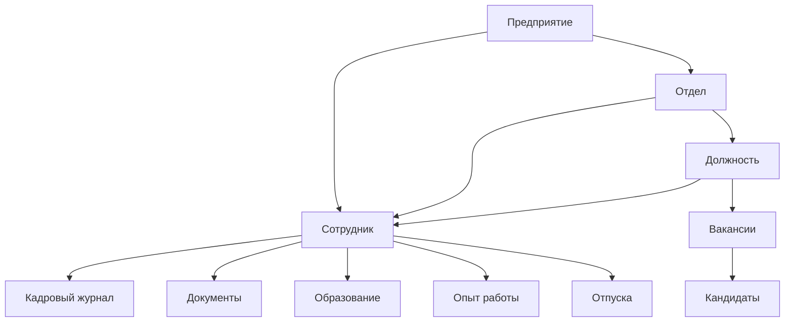
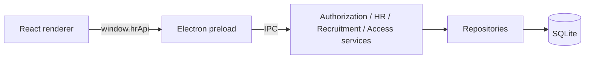

# HR Automation

Локальное desktop-приложение для кадрового учёта на Electron, React и SQLite. HR Automation хранит данные на компьютере пользователя и закрывает базовые процессы HR Core: организационную структуру, сотрудников, кадровые изменения, документы, подбор, отпуска, аналитику, роли и права доступа, аудит, импорт/экспорт и резервное копирование.

> Текущее состояние проекта описывает HR Core. Модуль бухгалтерских начислений/payroll в текущую модель не входит и должен развиваться отдельно от кадрового ядра.

## Основные возможности

- несколько предприятий внутри одной установки HR Automation;
- предприятия, отделы и должности;
- категории/организационно-правовые формы предприятий;
- руководитель предприятия и руководитель отдела с проверкой фактического назначения;
- карточка сотрудника с кадровыми, договорными и контактными данными;
- образование и предыдущий опыт работы;
- документы сотрудника с типами документов предприятия и локальным файловым хранилищем;
- перевод между отделами, должностями и предприятиями через отдельное кадровое действие;
- изменение текущей зарплаты через кадровое действие;
- исправление даты приёма с обязательным основанием;
- увольнение без физического удаления сотрудника;
- неизменяемый кадровый журнал `employment_history`;
- вакансии, hard/soft skills и кандидаты;
- история этапов кандидата;
- найм кандидата с созданием сотрудника;
- общий реестр отпусков и отпуска в карточке сотрудника;
- справочник видов отпусков по предприятиям;
- фиксация статуса, даты и автора согласования отпуска;
- HR-аналитика и очередь «Требует внимания» на главной странице;
- импорт сотрудников из CSV/XLSX и расширенный экспорт;
- встроенный `superadmin` и пользователи, связанные с сотрудниками;
- системные и пользовательские роли, permissions и scope-ограничения;
- рабочий контекст предприятия/отдела для company-wide ролей;
- журнал действий;
- резервные копии SQLite и восстановление;
- light/dark/system theme и выбор акцентного цвета.

## Организационная модель


```mermaid
flowchart TD
  Enterprise[Предприятие] --> Department[Отдел]
  Department --> Position[Должность]
  Enterprise --> Employee[Сотрудник]
  Department --> Employee
  Position --> Employee
  Employee --> History[Кадровый журнал]
  Employee --> Documents[Документы]
  Employee --> Education[Образование]
  Employee --> Experience[Опыт работы]
  Employee --> Vacation[Отпуска]
  Position --> Vacancy[Вакансии]
  Vacancy --> Candidate[Кандидаты]
```

Ключевые правила структуры:

- каждый новый сотрудник обязательно принадлежит конкретному предприятию;
- отдел обязательно относится к одному предприятию, и предприятие существующего отдела нельзя менять обычным редактированием;
- должность обязательно относится к одному отделу и не может быть перенесена в отдел другого предприятия;
- название отдела уникально внутри предприятия, а название должности — внутри отдела;
- должность хранит название и обязанности, но не является источником текущей зарплаты сотрудника;
- если сотруднику назначены отдел и должность, они должны принадлежать его предприятию;
- руководитель предприятия должен быть активным сотрудником этого предприятия;
- руководитель отдела должен быть активным сотрудником этого отдела;
- один сотрудник не может одновременно занимать конфликтующие руководящие назначения;
- руководителя нельзя перевести или уволить, пока руководящее назначение не снято;
- перевод сотрудника в другое предприятие не переносит вместе с ним административные полномочия старого предприятия.

## Сотрудники и кадровый lifecycle

Текущая карточка сотрудника хранит, в частности:

- предприятие;
- табельный номер;
- ФИО, дату рождения и пол;
- адрес, телефон и email;
- отдел и должность;
- текущую зарплату;
- дату приёма и статус;
- тип занятости;
- номер и даты договора;
- окончание испытательного срока;
- рабочее место;
- дату и основание увольнения.

Email сотрудника является контактным полем, а не платформенным идентификатором: одинаковый адрес может встречаться в нескольких кадровых записях и у кандидата/сотрудника. Табельный номер уникален **внутри предприятия**, поэтому разные предприятия могут использовать одинаковую нумерацию.

При ручном создании сотрудника сначала выбирается предприятие, затем доступные отдел и должность. Backend повторно проверяет эту принадлежность независимо от UI.

Поля назначения, зарплаты, даты приёма и статуса не изменяются обычным CRUD. Для них используются отдельные команды:

- `hr:changeEmployment` — перевод/смена предприятия, отдела, должности и, при необходимости, зарплаты;
- `hr:correctHireDate` — исправление даты приёма;
- `hr:terminateEmployee` — увольнение.

Каждое кадровое действие требует даты и основания. Изменение сотрудника и запись в кадровый журнал выполняются транзакционно.

`employment_history` является системным журналом: записи создаются автоматически и недоступны для ручного создания, изменения или удаления. История дополнительно хранит snapshot предыдущего и нового предприятия, чтобы последующий перевод сотрудника не переписывал контекст уже произошедшего события.

## Документы сотрудников

Документы находятся непосредственно в карточке сотрудника. Тип документа выбирается из справочника его предприятия.

Для документа сохраняются:

- сотрудник и, при наличии, связанное кадровое событие;
- тип и название;
- исходное имя и контролируемый локальный путь;
- MIME type, размер и SHA-256;
- дата выдачи и срок действия;
- состояние удаления;
- snapshot предприятия на момент добавления документа.

Snapshot предприятия отображается в карточке и остаётся неизменным после последующих переводов сотрудника.

## Подбор персонала

Вакансия привязана к существующей должности и хранит:

- статус;
- формат занятости;
- количество открытых мест;
- набор hard/soft skills;
- требуемый уровень каждого навыка.

Кандидат относится к вакансии, проходит этапы `new → screening → interview → offer → hired` либо `rejected` и получает оценки по навыкам вакансии. История смены этапов хранится отдельно.

Команда найма создаёт сотрудника из кандидата, определяет предприятие через должность/отдел вакансии и сохраняет контактный email кандидата в новой карточке сотрудника. Повторный найм одного кандидата запрещён бизнес-логикой.

## Отпуска

В приложении есть единый раздел **«Отпуска»** и вкладка отпусков в карточке сотрудника.

Отпуск хранит:

- сотрудника;
- ссылку на `vacation_types` своего предприятия;
- snapshot предприятия на момент оформления;
- даты начала и окончания;
- рассчитанное количество календарных дней;
- признак оплаты;
- основание;
- статус `planned`, `approved`, `rejected` или `completed`;
- дату и автора согласования.

Backend сам рассчитывает количество календарных дней и контролирует переходы статусов. Свободно редактируется только `planned`. После принятия решения кадровые параметры записи защищены от переписывания; `approved` можно завершить, а `rejected` и `completed` остаются историей. Удалять можно только ещё не рассмотренный `planned`.

Отдельный старый backend «Управления отпусками» с отпускными балансами и производственным календарём удалён. Таблицы `leave_balances` и `work_calendar_days`, permissions `leave.*` и соответствующие IPC/preload API больше не являются частью актуальной модели.

Справочник видов отпусков имеет собственные granular permissions `vacation_types.view/create/edit/delete` и принадлежит предприятию.

## Рабочий контекст предприятия

Одна установка может содержать несколько предприятий. Для company-wide пользователя `global` означает доступ на уровне всей установки, но операционные HR-разделы работают внутри выбранного бизнес-контекста:

1. выбирается предприятие;
2. при необходимости контекст дополнительно сужается до отдела;
3. backend преобразует только глобальные operational permissions в scope выбранного предприятия/отдела.

Выбирать контекст могут встроенный `superadmin` и обычный пользователь, у которого есть глобально scoped HR-permission, участвующий в Business Context.

Важные ограничения:

- реестр сотрудников для company-wide доступа остаётся межпредприятийным;
- локальное `enterprise`-право остаётся привязано к домашнему предприятию пользователя;
- локальное `department`-право остаётся привязано к домашнему отделу;
- выбор другого предприятия не заставляет локальную роль «переехать» вместе с UI-контекстом;
- смена предприятия сбрасывает несовместимый отдел.

## Авторизация и RBAC

Есть два вида учётных записей:

1. встроенный системный администратор `superadmin`, не связанный с сотрудником;
2. обычный пользователь, обязательно и уникально связанный с одним сотрудником.

Данные первого входа:

```text
login:    superadmin
password: superadmin
```

Для заводского пароля устанавливается обязательная смена при первом реальном входе. Пароли хранятся как `scrypt` hash + salt.

Системные роли включают:

- `Superadmin` — только встроенный системный аккаунт, global;
- `Сотрудник` — собственный профиль и разрешённые self-функции;
- `Руководитель предприятия`;
- `Руководитель отдела`;
- `Администратор предприятия` — операционное администрирование в scope предприятия;
- `Администратор отдела` — операционное администрирование в scope отдела.

`enterprise_admin` автоматически отзывается при переводе сотрудника в другое предприятие, а `department_admin` — при выходе из отдела, в котором это полномочие было действительно. Это исключает перенос административного доступа вместе с кадровым переводом.

Дополнительно можно создавать пользовательские роли с permissions и допустимой областью данных. Scope вычисляется отдельно для каждого permission. Серверные проверки выполняются перед чтением и мутациями, поэтому скрытие кнопок в React не является механизмом безопасности само по себе.

Renderer синхронизирует текущую сессию после кадровых/access-мутаций и при возврате фокуса в приложение. Backend при каждом защищённом IPC-запросе заново получает актуальную сессию из БД.

Подробности: [`docs/access-control.md`](docs/access-control.md).

## Импорт и экспорт

Импорт сотрудников поддерживает CSV/XLSX, сопоставление колонок и dry-run. Для каждой строки обязательно определяется предприятие: из колонки файла либо из текущего enterprise-контекста. Табельный номер проверяется на дубликат только внутри этого предприятия; email не используется как ключ дедупликации.

Расширенный экспорт поддерживает CSV/XLSX для сотрудников, структуры, отпусков, кадрового журнала, вакансий и аудита и учитывает эффективный scope пользователя.

## Аудит

Критические действия записываются в audit log с указанием:

- времени;
- типа и ID аккаунта;
- username;
- действия;
- типа и ID сущности;
- состояния до/после, когда применимо;
- дополнительной metadata.

## Архитектура


```mermaid
flowchart LR
  Renderer[React renderer] -->|window.hrApi| Preload[Electron preload]
  Preload -->|IPC| Services[Authorization / HR / Recruitment / Access services]
  Services --> Repositories[Repositories]
  Repositories --> SQLite[(SQLite)]
```

### Renderer

React не имеет прямого доступа к Node.js и SQLite. Вызовы идут через `src/shared/lib/hrApiClient.ts` и ограниченный preload API.

### Electron

Окно работает с:

- `sandbox: true`;
- `contextIsolation: true`;
- `nodeIntegration: false`.

IPC-запросы дополнительно проверяют trusted sender и валидируются через Zod. Generic HR CRUD принимает только разрешённые сущности, колонки и скалярные значения.

### Backend

Основные слои:

```text
electron/
├── admin/          # whitelist HR CRUD сущностей/полей
├── database/       # подключение SQLite и migrations runner
├── ipc/            # IPC handlers и validation
├── migrations/     # SQL migrations
├── repositories/   # SQL и транзакции
├── seed/           # только development demo data
└── services/       # business logic, authorization, audit, backup
```

## База данных

SQLite-файл:

```text
<Electron userData>/database/hr-automation.sqlite
```

Используются:

- `journal_mode = WAL`;
- `foreign_keys = ON`;
- SQL migrations с таблицей `schema_migrations`;
- UNIQUE indexes и triggers для критичных правил целостности.

Основные таблицы текущего HR Core:

- `enterprises`;
- `departments`;
- `positions`;
- `employees`;
- `employee_education`;
- `employee_experience`;
- `employment_history`;
- `document_types`;
- `employee_documents`;
- `vacation_types`;
- `vacations`;
- `vacancies`;
- `vacancy_skills`;
- `candidates`;
- `candidate_skill_scores`;
- `candidate_status_history`;
- `data_exchange_runs`;
- `permissions`;
- `roles`;
- `role_permissions`;
- `users`;
- `user_roles`;
- `system_admin_accounts`;
- `audit_events`;
- `schema_migrations`.

Миграции выполняются в лексикографическом порядке. CI применяет весь набор на чистой in-memory SQLite, выполняет `PRAGMA foreign_key_check`, отдельно проверяет upgrade существующих данных и integration invariants организационной структуры.

## Demo seed

Демонстрационные данные создаются **только в development**, когда Electron запущен не из packaged-сборки и бизнес-таблицы пусты.

В production seed не выполняется.

## Backup

Административный раздел поддерживает:

- создание резервной копии SQLite;
- просмотр доступных backup-файлов;
- восстановление из backup;
- открытие каталога backup.

Операции требуют соответствующих permissions и попадают в audit log.

## Технологии

| Область | Технологии |
| --- | --- |
| Desktop | Electron 43, electron-builder |
| Frontend | React 18, TypeScript, Vite 7 |
| UI | Tailwind CSS 4, Radix UI, React Icons |
| Forms | React Hook Form, Zod |
| Animations | Framer Motion |
| Database | SQLite, better-sqlite3 |
| Localization | i18next, react-i18next |

## Разработка

Требуется Node.js 22.x и npm.

```bash
git clone https://github.com/ramzansharifov/hr-automation.git
cd hr-automation
npm install
npm run dev
```

HR-функции работают в Electron-окне. Обычный браузер не получает `window.hrApi`.

Основные команды:

```bash
npm test
npm run lint
npm run build:check
npm run build
```

CI дополнительно проверяет:

- применение SQLite migrations и upgrade существующей БД;
- HR Core integration invariants;
- production dependency audit на high/critical vulnerabilities;
- ESLint без warnings;
- TypeScript и production renderer build;
- Electron renderer smoke test.

## Production build

```bash
npm run build
```

`electron-builder` формирует установочные артефакты в `release/`.

Пользовательская SQLite-база находится вне каталога приложения и не удаляется вместе с обычной пересборкой приложения.

## Текущие ограничения

- приложение local-first и пока не синхронизирует данные между компьютерами;
- SQLite-файл не зашифрован на уровне приложения;
- нет отдельного payroll/payments/accounting-модуля;
- отпускной реестр использует календарные дни и не включает отдельный производственный календарь/балансы;
- файлы документов хранятся локально на устройстве установки.

Перед использованием в среде с повышенными требованиями к персональным данным следует отдельно определить политику шифрования диска, хранения backup, управления устройствами и сроков хранения audit log.
